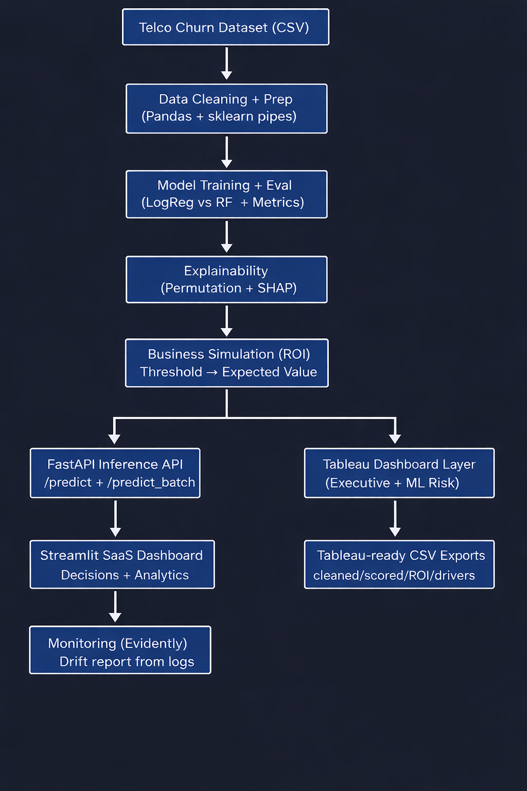
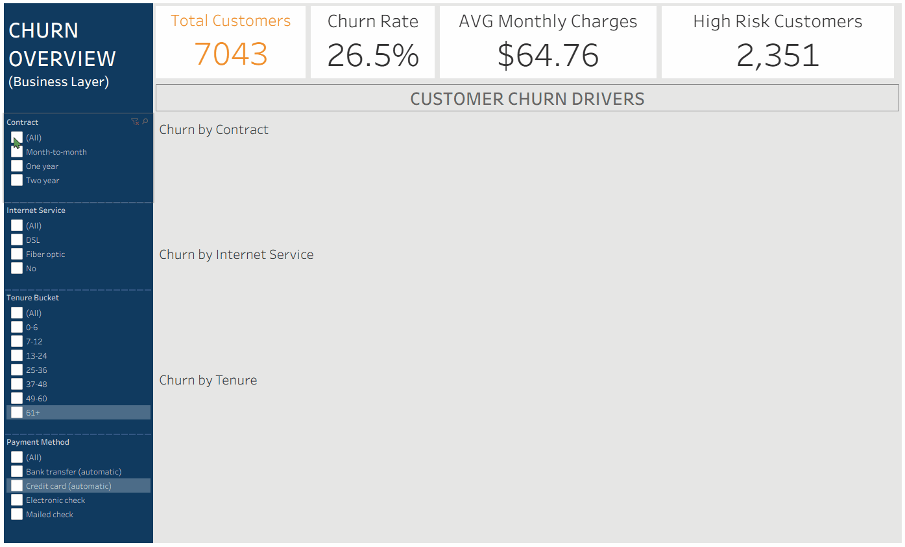
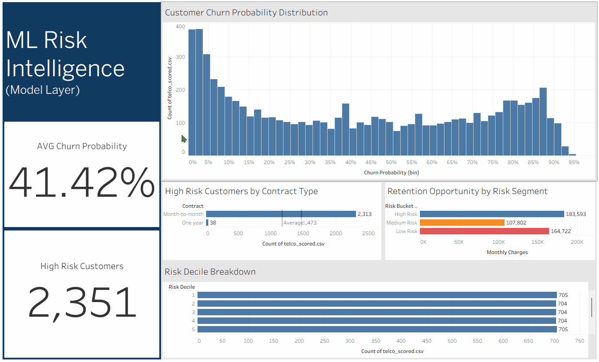
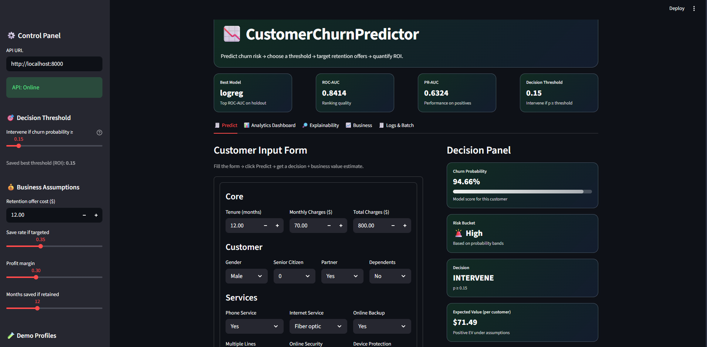
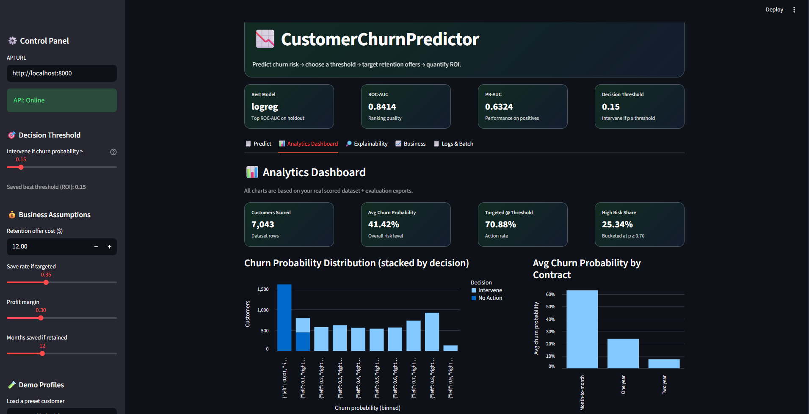
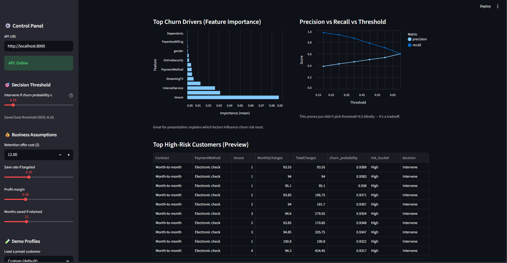
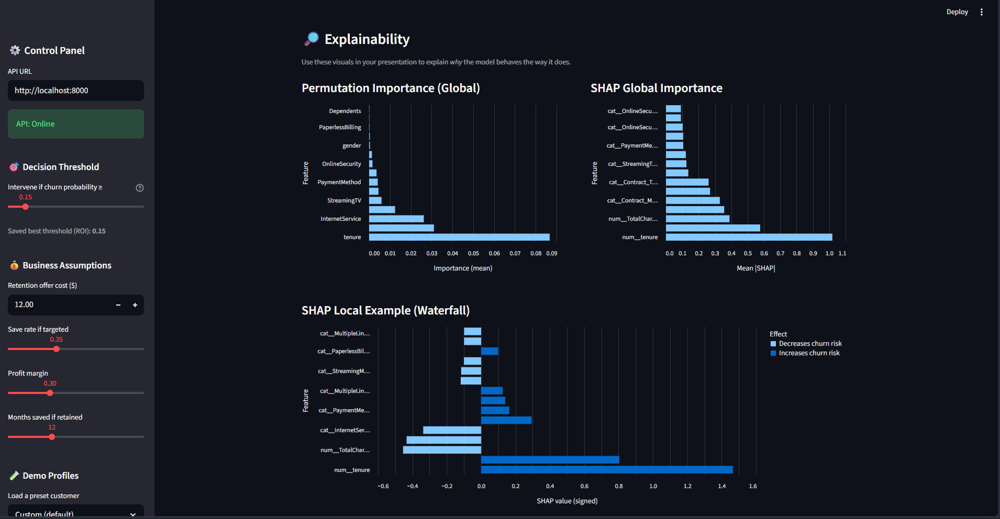
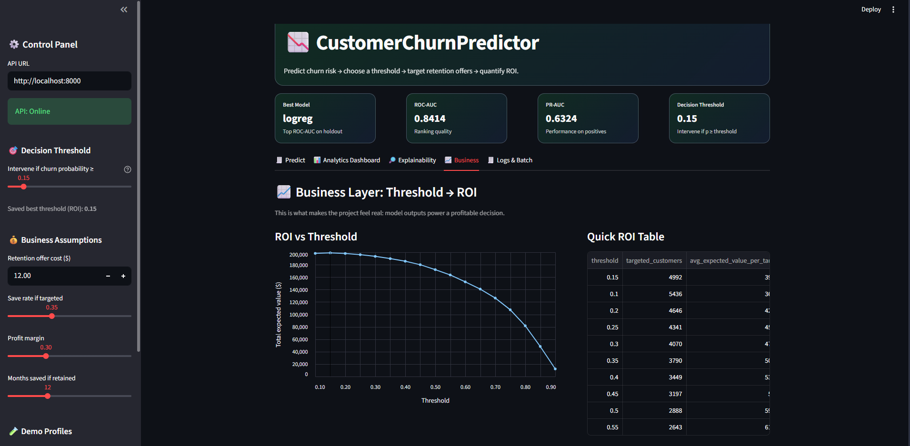
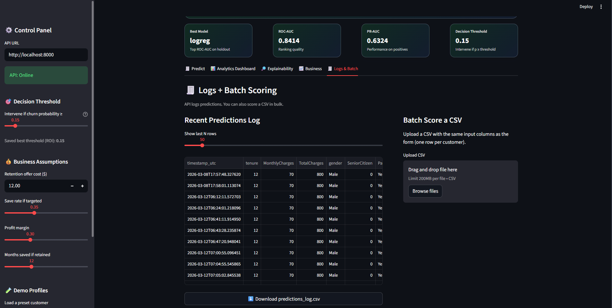

<h1 align="center">👨🏼‍💼 Customer Churn Predictor 📊</h1>
<h3 align="center">Machine Learning Risk Intelligence + Executive Business Dashboard</h3>

<p align="center">
  
  
  
  
  
  
  
  
  
  
  
</p>

<p align="center">
  <!-- Replace the src below with your centered demo GIF path, e.g. assets/demo.gif -->
  
</p>

---

## 📖 Project Overview

Customer churn is one of the **most critical problems in subscription businesses**.  
Losing customers directly impacts **revenue, growth, and acquisition costs**.

**CustomerChurnPredictor** is an end-to-end churn risk system that combines:

- ✅ Machine Learning prediction (probability scoring)
- ✅ Risk segmentation (buckets + deciles)
- ✅ ROI-based decisioning (threshold → business value)
- ✅ FastAPI inference service (single + batch prediction)
- ✅ Streamlit modern SaaS dashboard (interactive demo + analytics)
- ✅ Monitoring with Evidently (data drift report)
- ✅ Tableau dashboards for executive stakeholders

The solution is designed to answer:

> **“Who is most likely to churn next, and what should we do about it?”**

---

## 🎯 What Makes This Project Portfolio-Grade

Most churn projects stop at accuracy. This project goes further:

- **Probability → Decision Policy:** Intervene only above a chosen threshold  
- **Threshold is ROI-driven:** We simulate expected value across thresholds (not random 0.50 defaults)  
- **Explainability built-in:** SHAP + permutation importance  
- **Deployed system:** API + UI + logs + monitoring  
- **Executive dashboards:** Tableau-ready exports + dashboard suite

---

## 🧱 System Architecture

<p align="center">
    
  </p>

---

## 🗂️ Repository File Structure

```
CustomerChurnPredictor/
├─ churn/                      # Core ML + API + monitoring modules
│  ├─ data.py                  # Download + clean dataset
│  ├─ modeling.py              # Preprocess + candidate models
│  ├─ train.py                 # Train + save best model
│  ├─ evaluate.py              # Metrics + confusion matrix + threshold scan
│  ├─ explain.py               # Permutation + SHAP explainability
│  ├─ business.py              # ROI simulation + best threshold
│  ├─ tableau_export.py        # Exports final Tableau-ready CSVs
│  ├─ api.py                   # FastAPI inference service + logging
│  ├─ monitor.py               # Evidently drift report
│  └─ config.py                # Paths, columns, business defaults
│
├─ app/
│  └─ streamlit_app.py         # Modern SaaS Streamlit UI
│
├─ data/                       # Local-only data (ignored in git except placeholder)
│  ├─ raw/
│  ├─ processed/
│  ├─ tableau/                 # Exports for Tableau dashboards
│  └─ logs/                    # API prediction logs
│
├─ models/                     # Saved model artifact (model.joblib) + metadata
├─ reports/
│  ├─ figures/                 # Explainability + ROI plots (PNG/CSV)
│  ├─ metrics/                 # Model metrics, threshold scan, best threshold
│  └─ monitoring/              # Drift report HTML
│
├─ tableau/                    # Tableau workbook (.twbx) + screenshots
│  └─ screenshots/
│
├─ tests/                      # Basic CI tests
├─ requirements.txt
├─ requirements-dev.txt
├─ Makefile
└─ README.md
```

---

## 🧠 Churn Prediction Pipeline

```
Raw Telco Dataset
        ↓
Data Cleaning & Feature Engineering (Pandas)
        ↓
Preprocessing Pipeline (Impute + Scale + OneHotEncode)
        ↓
Classification Models (LogReg, RF)
        ↓
Churn Probability Scores (0–1)
        ↓
Risk Segmentation (Buckets + Deciles)
        ↓
ROI-Based Threshold Decisioning
        ↓
FastAPI + Streamlit + Monitoring + Tableau Dashboards
```

---

## 📊 Tableau Dashboards (Two-Dashboard Workflow)

> You requested a 2-dashboard workflow:
- **Dashboard 1: Churn Overview (Executive / Business Analysis)**
- **Dashboard 2: ML Risk Intelligence (Predictive + Decision Layer)**

### Dashboard 1 — Churn Overview (Business Analysis)

<p align="center">
  <!-- Replace with your overview dashboard GIF path -->
  
</p>

Focus: historical churn patterns and segmentation insights.

**KPIs**
- Total Customers
- Churn Rate
- Avg Monthly Charges
- Avg Tenure

**Visuals**
- Churn by Contract Type
- Churn by Internet Service
- Churn by Payment Method
- Churn by Tenure Bucket
- Interactive filters (Contract, InternetService, PaymentMethod, SeniorCitizen)

---

### Dashboard 2 — ML Risk Intelligence (Predictive)

<p align="center">
  <!-- Replace with your ML dashboard GIF path -->
  
</p>

Focus: who will churn next and what to do.

**KPIs**
- Avg Churn Probability
- High Risk Count (≥ threshold)
- Targeted Customers (decision policy)

**Visuals**
- Churn probability distribution
- Risk decile breakdown (Top 10% = Decile 10)
- High-risk customers table
- ROI threshold curve (Total Expected Value vs Threshold)

---

## 📦 Tableau Data Files (Ready to Connect)

After running:
```bash
python -m churn.tableau_export
```

Tableau-ready exports are generated in:
- `data/tableau/telco_cleaned.csv`  
- `data/tableau/telco_scored.csv`  
- `data/tableau/roi_thresholds.csv`  
- `data/tableau/feature_importance.csv`  
- `data/tableau/threshold_scan.csv`  

---

## 🖥️ Streamlit SaaS Dashboard

The Streamlit app includes:
- KPI cards (model performance + threshold)
- Predict tab (decision + EV per customer)
- Analytics dashboard tab (stacked distributions + drivers + threshold tradeoffs)
- Explainability tab (Permutation + SHAP global/local)
- Business tab (ROI curve + threshold strategy)
- Logs & batch scoring tab (CSV upload + /predict_batch)

<details>
  <summary><b>▶️ Predict Page</b></summary>
  <br/>
  <p align="center">
    
  </p>
</details>

<details>
  <summary><b>▶️ Analytics Dashboard (Part 1)</b></summary>
  <br/>
  <p align="center">
    
  </p>
</details>

<details>
  <summary><b>▶️ Analytics Dashboard (Part 2)</b></summary>
  <br/>
  <p align="center">
    
  </p>
</details>

<details>
  <summary><b>▶️ Explainability Page</b></summary>
  <br/>
  <p align="center">
    
  </p>
</details>

<details>
  <summary><b>▶️ Business Page</b></summary>
  <br/>
  <p align="center">
    
  </p>
</details>

<details>
  <summary><b>▶️ Logs & Batch Page</b></summary>
  <br/>
  <p align="center">
    
  </p>
</details>

---

## 🌐 FastAPI Inference Service

Endpoints:
- `GET /health` — service status  
- `POST /predict` — score one customer  
- `POST /predict_batch` — score many rows (batch scoring)

All predictions are logged to:
- `data/logs/predictions_log.csv`

This log is used for monitoring drift.

---

## ⚡ FastAPI + Local Model (How It Works)

In this project, **FastAPI acts as the bridge between the trained machine learning model and the user interface**.

### 🔗 Local Development Setup (Project Mode)

During development, the system runs in two parts:

1. **FastAPI Backend (Model Server)**
   - Loads the trained model (`model.joblib`)
   - Exposes prediction endpoints:
     - `/predict` → single customer
     - `/predict_batch` → multiple customers
   - Handles inference logic and logging

2. **Streamlit Frontend (Dashboard UI)**
   - Collects user input (customer data)
   - Sends requests to FastAPI
   - Displays:
     - churn probability
     - decision (intervene or not)
     - expected business value

👉 Flow:

```
User Input (Streamlit)
        ↓
HTTP Request → FastAPI (/predict)
        ↓
Model (joblib) → Prediction
        ↓
Response → Streamlit UI
```

This setup mimics a **real production ML system**, where:
- UI ≠ Model  
- Communication happens via APIs  

---

## 🚀 Why FastAPI Is Used

FastAPI is chosen because it is:

- ⚡ **Fast and lightweight** (high-performance inference)  
- 📦 **Production-ready** (used in real ML systems)  
- 🔌 **Easy to integrate** with frontends (Streamlit, React, etc.)  
- 📊 Supports **batch inference** and scalability  

---

## 🌍 Production Deployment (Real-World System)

In a real production environment, this system would be deployed as:

### 🏗️ Production Architecture

- FastAPI → deployed on cloud (AWS / GCP / Azure)  
- Model → stored in object storage (S3 / GCS)  
- Load balancer → handles traffic  
- Database → stores prediction logs  
- Frontend → separate app (React / dashboard)  

### Example Flow:

```
User → Web App
        ↓
API Gateway / Load Balancer
        ↓
FastAPI Service (Docker container)
        ↓
Model Inference
        ↓
Response + Logging (Database)
```

### 🔧 Deployment Tools (Industry Level)

- Docker (containerization)  
- Kubernetes (scaling)  
- AWS ECS / Lambda / EC2  
- CI/CD pipelines (GitHub Actions)  

---

## 💡 Why This Project Uses a Simpler Approach

Since this is an **academic + portfolio project**, we use a simplified setup:

- FastAPI runs locally (`http://localhost:8000`)  
- Streamlit connects directly to it  
- No cloud infrastructure required  
- No cost involved  

This allows:

- ✅ Fast development  
- ✅ Easy debugging  
- ✅ Zero deployment cost  
- ✅ Demonstrates full ML system design  

---

## 🧠 Smart Hybrid Design (Cloud + Local Fallback)

The project also supports a **fallback mode**:

- If FastAPI is **offline**, Streamlit:
  - loads `model.joblib` directly  
  - performs predictions locally  

This ensures:

- 🚫 No dependency on backend uptime  
- 🌐 Works on Streamlit Cloud  
- 💼 Demonstrates **resilient system design**  

---

## 🎯 Why This Matters

This architecture shows that the project is not just:

> ❌ “a machine learning model”

It is:

> ✅ **a complete ML system with deployment, APIs, UI, and monitoring**

---

## 💬 Summary of API framework

> “I deployed my churn model behind a FastAPI service, which the Streamlit dashboard calls in real-time. I also implemented a local fallback so the system works even without a backend—making it both production-ready and deployable for free.”

---
## 📈 Monitoring (Evidently Drift Report)

Run:
```bash
python -m churn.monitor
```

Output:
- `reports/monitoring/data_drift_report.html`

This compares:
- reference sample (saved during training)
- current inference logs (from API)

---

## 🚀 How to Run (End-to-End)

### 1) Setup
```bash
python -m venv .venv
# Windows:
.\.venv\Scripts\Activate.ps1
pip install -r requirements.txt
pip install -r requirements-dev.txt
```

### 2) Build the full pipeline
```bash
python -m churn.data --download
python -m churn.train
python -m churn.evaluate
python -m churn.explain
python -m churn.business
python -m churn.tableau_export
```

### 3) Run API + UI
Terminal A:
```bash
python -m churn.api
```

Terminal B:
```bash
python -m streamlit run app/streamlit_app.py
```

---

## 💡 Key Insights (Examples)

- Month-to-month contracts are consistently the **highest churn risk**
- Long-term contracts (1–2 year) strongly reduce churn likelihood
- Churn risk is concentrated: a smaller segment can represent a large share of revenue exposure
- Probability-based segmentation enables targeted retention strategies instead of broad campaigns

---

## 📈 Potential Business Applications

Companies can use this system to:
- identify high-risk customers early
- deploy targeted retention campaigns
- improve contract conversion strategies
- protect recurring revenue with ROI-optimized decisions

---

## 👥 Authors

<table align="center">
  <tr>
    <td align="center" width="220">
      <b>Mitra Boga</b><br/><br/>
      <a href="https://www.linkedin.com/in/bogamitra/">
        
      </a>
      <a href="https://x.com/techtraboga">
        
      </a>
    </td>
    <td align="center" width="220">
      <b>Yashweer Potelu</b><br/><br/>
      <a href="https://www.linkedin.com/in/sai-yashweer-potelu-1233272a3/">
        
      </a>
      <a href="https://github.com/yashweer23">
        
      </a>
    </td>
    <td align="center" width="220">
      <b>Datla Akshith Varma</b><br/><br/>
      <a href="https://www.linkedin.com/in/akshith-varma-datla-6a4251302/">
        
      </a>
      <a href="https://github.com/Akshith-v">
        
      </a>
    </td>
    <td align="center" width="220">
      <b>Pranav Surya</b><br/><br/>
      <a href="https://www.linkedin.com/in/pranav-surya-0b5b13301/">
        
      </a>
      <a href="https://github.com/pranavsurya28">
        
      </a>
    </td>
  </tr>
</table>
